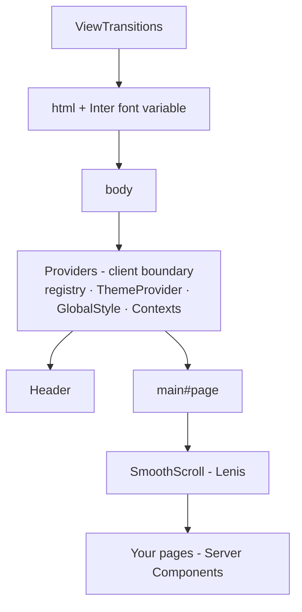

✨ An animation-first Next.js starter kit for agencies: styled-components, a zero-JS grid system, CSS-variable design tokens, GSAP + Lenis, and a CMS-ready data layer — tuned so the out-of-the-box Lighthouse story is something you can show a client. ✨


> Full guides live in [`docs/`](./docs) — this README is the map.

## 🚀 Quickstart

```bash
# Scaffold into an empty directory / freshly-created git repo (recommended)
mkdir my-app && cd my-app     # or clone your empty repo and cd in
bunx tackl                    # asks: DatoCMS, Sanity, or no CMS
bun run dev

# …or clone this repo directly (keeps both CMS adapters)
git clone https://github.com/12-studio/tackl my-app
cd my-app && bun install && bun run dev
```

The CLI keeps your existing `.git`/remote, prunes the CMS you didn't pick (code, dependencies, docs, env keys), and installs with bun. `bun create tackl` and `npm create tackl@latest` work too.

Open [http://localhost:3000](http://localhost:3000). The placeholder screen you see is `src/components/DeleteMe` — delete it (and its usage in `app/(home)/page.tsx`) and start building.

Copy `.env.example` to `.env` and fill in your values (the DatoCMS token, etc.). `.env` is gitignored; `.env.example` is the documented template.

### Scripts

| Command | What it does |
| --- | --- |
| `bun run dev` | Dev server (Turbopack) |
| `bun run build` | Production build (Turbopack) |
| `bun run start` | Serve the production build |
| `bun run type-check` | TypeScript, no emit |
| `bun run lint` / `lint:fix` | Biome check / auto-fix |
| `bun run format` | Biome format |
| `bun run storybook` | Storybook dev on :6006 |
| `bun run build-storybook` | Static Storybook build |
| `bun run lighthouse` | Lighthouse CI run |
| `git commit` | Husky runs the guided commit-message prompt |

## 🎯 What's in the box

- **Next.js 16 (App Router)** — server-owned document shell, working `metadata`/`viewport` exports, Turbopack dev *and* prod builds
- **TypeScript everywhere** — strict, with typed design tokens that derive from the values (add a token, the type follows)
- **styled-components v6** — SSR wired via the registry; one polymorphic `Div` primitive instead of a component per HTML tag
- **Tackl theming** — every design token is a CSS custom property on `:root`; runtime theming (dark mode, white-label) is a CSS override, not a re-render
- **Waffl grid** — a 12/6/2-column grid with **zero JavaScript**; plain and server-rendered elements are first-class grid children
- **GSAP + ScrollTrigger + Lenis** — smooth scrolling and scroll animations, pre-wired to share one ticker, with `prefers-reduced-motion` users automatically getting native scroll and no rAF loop
- **View Transitions** — page transitions via the View Transitions API with a typed `Link`/router wrapper
- **Storybook 10** — token-aware (the preview renders the same `:root` variables as the app)
- **Biome + Husky** — linting, formatting, and a guided commit-message flow
- **CMS adapters behind one seam** — app code imports `fetchContent` from `@cms`; DatoCMS (GraphQL) and Sanity (GROQ) adapters ship in the template, and the CLI prunes to your choice at scaffold time
- **SEO plumbing** — `metadata`/`viewport` exports, `sitemap.xml` and `robots.txt` (staging deploys auto-blocked from indexing), all driven by one `NEXT_PUBLIC_SITE_URL`

### Performance posture

The kit ships **~210 KB of gzipped JS** on first load. That budget is spent deliberately: React + Next (~120 KB), GSAP + ScrollTrigger + Lenis (~45 KB), styled-components (~13 KB). Everything else is engineered to cost nothing at runtime — the grid is pure CSS, the token system is CSS variables (no theme re-renders), `sideEffects` is configured so unused exports tree-shake, fonts load as a single variable-font file, and reduced-motion users skip the animation stack entirely.

## 🧠 Core concepts (5-minute tour)

### 1. One component: `Div`

Tackl exports **one** semantic primitive. Pick the rendered tag with `as`:

```tsx
import { Div } from '@tackl';

<Div as='section' $pad>…</Div>
<Div as='h1' $m='2/6' $l='3/9'>Heading</Div>
```

Every `Div` accepts spacing props (`$mar`, `$pad`, …), responsive grid-span props (`$s`…`$uber`), and — because it's a real `styled.div` — all normal HTML attributes, fully typed. In styles files you fix the tag once: `styled(Div).attrs({ as: 'header' })`.

➜ [docs/Tackl/WritingComponents.md](./docs/Tackl/WritingComponents.md)

### 2. Tokens are CSS variables

Raw values live once in `src/theme/*`; `GlobalStyle` emits them on `:root`; everything — styled-components, plain CSS, Server Components — references them:

```tsx
background: ${getBrand('bc1')};        /* → var(--brand-bc1) */
border-color: ${getBrand('bc1', 20)};  /* → color-mix(in srgb, var(--brand-bc1) 20%, transparent) */
```

```css
.card { padding: var(--space-m); }     /* plain CSS works too */
```

Dark mode / white-labeling = redefine variables under `html[data-theme='…']`. No JS.

➜ [docs/Tackl/Theming.md](./docs/Tackl/Theming.md)

### 3. The Waffl grid

`Grid` (from `@waffl`) renders a plain `<waffl-grid>` tag — no web component, no client JS. Children span the full grid by default; span props opt into columns per breakpoint:

```tsx
import Grid from '@waffl';

<Grid $isFixed>
	<Div as='article' $m='2/6' $l='1/7'>Half on desktop</Div>
	<figure>Plain elements work too — full width by default</figure>
</Grid>
```

### 4. Mobile-first breakpoints: `bp`

Base styles are mobile. `bp.m`, `bp.l`, … layer upwards with `min-width` queries:

```tsx
import { bp } from '@tackl';

font-size: 1.8rem;              /* mobile default */
${bp.m` font-size: 2.4rem; `}   /* ≥ 700px */
${bp.l` font-size: 3.2rem; `}   /* ≥ 1024px */
```

(`bpd` exists for the rare max-width case.)

### 5. Motion, responsibly

`SmoothScroll` wires Lenis into GSAP's ticker (one clock for scrolling and ScrollTrigger). Users with `prefers-reduced-motion` skip Lenis entirely — native scroll, no animation loop. Register component animations with `useGSAP` and they clean themselves up.

➜ [docs/Motion.md](./docs/Motion.md) · [docs/GSAP](./docs/GSAP)

## 🏗 Architecture



`app/layout.tsx` (a Server Component) owns the document shell and site-wide `metadata`. `app/Providers.tsx` is the only client boundary in the shell — page content passes through it as `children`, so your pages stay server-rendered.

➜ [docs/Tackl/AppArchitecture.md](./docs/Tackl/AppArchitecture.md)

## 📁 Project structure

    .
    ├── app/                    # Routes (App Router)
    │   ├── layout.tsx          # Server shell: html/body, metadata, chrome
    │   ├── Providers.tsx       # Client providers (styled-components, contexts)
    │   ├── (home)/             # Home route group
    │   ├── sitemap.ts          # /sitemap.xml
    │   ├── robots.ts           # /robots.txt (blocks staging deploys)
    │   └── icon.svg            # Favicon
    ├── src/
    │   ├── cms/                # CMS seam — import from '@cms' only
    │   │   ├── index.ts        # Adapter switch (the line the CLI rewires)
    │   │   ├── dato/           # DatoCMS adapter (GraphQL)
    │   │   └── sanity/         # Sanity adapter (GROQ)
    │   ├── components/         # UI components (one folder each — see WritingComponents.md)
    │   ├── theme/              # Design tokens + the tackl toolkit
    │   │   ├── colors|space|gap|borderRadius|easing|time|fonts|grid/
    │   │   ├── cssVariables/   # toVarRefs / toVarDeclarations helpers
    │   │   └── tackl/          # Div, getters, bp/bpd, alpha, type styles, waffl grid
    │   ├── css/global.css      # Reset, waffl default rule, reduced-motion fallback
    │   ├── config.ts           # siteUrl (drives metadataBase, sitemap, robots)
    │   ├── utils/              # Hooks and helpers (incl. viewTransitions)
    │   └── types/              # Ambient types (styled DefaultTheme, waffl-grid tag)
    ├── docs/                   # The full documentation set
    ├── public/                 # Static assets
    ├── tackl/                  # The Tackl CLI (npm: `tackl` + `create-tackl`)
    ├── .env.example            # Documented environment template
    ├── LICENSE                 # MIT
    ├── biome.json              # Lint + format config
    ├── next.config.js          # Images, compiler settings
    └── tsconfig.json           # Strict TS + path aliases (@tackl, @waffl, @theme, @cms, …)

## 📚 Documentation index

| Guide | What it covers |
| --- | --- |
| [WritingComponents](./docs/Tackl/WritingComponents.md) | File anatomy, comment style, imports, `Div`, grid spans, `bp` |
| [Theming](./docs/Tackl/Theming.md) | Tokens, CSS variables, opacity, runtime theming |
| [AppArchitecture](./docs/Tackl/AppArchitecture.md) | The app shell, Providers, data flow |
| [WafflGridSystem](./docs/Tackl/WafflGridSystem.md) · [GridSystemProps](./docs/Tackl/GridSystemProps.md) | Grid internals and prop reference |
| [SemanticComponents](./docs/Tackl/SemanticComponents.md) | The `Div` primitive in depth |
| [PerformanceContext](./docs/Tackl/PerformanceContext.md) | Reduced-motion and device signals |
| [Motion](./docs/Motion.md) · [GSAP](./docs/GSAP) | Animation patterns |
| [CMS](./docs/CMS.md) | The `@cms` adapter seam and choosing Dato/Sanity |
| [DatoCMS](./docs/DatoCMS) | Querying, images, structured text, SEO |
| [Sanity](./docs/Sanity/README.md) | Setting up the Sanity variant |
| [Lighthouse](./docs/Lighthouse.md) | Performance auditing |

## ✍️ Committing

Husky runs a guided prompt on `git commit` — describe the change, pick a type, and it formats a consistent message for you.

## 👥 Authors & Maintainers

Developed and maintained by the 12 Studio team:

- **Joe Taylor** (joe@12studio.agency)
- **Adam Roberts** (adam@12studio.agency)

Contributions welcome — check existing GitHub issues first, or reach the team at hello+tackl@12studio.agency.

### License

[MIT](./LICENSE) © 12 Studio — use it, ship client work with it, no strings beyond the notice.
